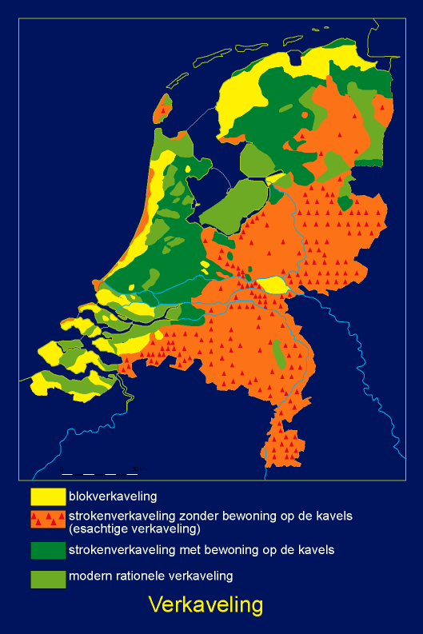

---
Tags:
- BNB/Jaar1/Groepsopdracht/Opdrachten/Cultuurhistorie
---
# Uitleg opdracht Cultuurhistorische Analyse

Bij de cultuurhistorische analyse kijk je naar de geschiedenis van het gebied, zowel naar de menselijke invloed als andere factoren die invloed hebben gehad op het landschap. Vervolgens geef je een waarde aan kenmerkende elementen en patronen van deze geschiedenis.

De volgende onderdelen verwerk je in je verslag:
1. [[#Deelgebieden]]
2. [[#Typeren]]
3. [[#Ontwikkelingen per periode]]
4. [[#Waarderen]]
5. [[#Bronnen]]

>[!Question] ONDUIDELIJK:
>In het originele opdracht document staat het volgende:
>
>*"Van het geheel maak je een rapport waarin je de standaard structuur volgens een goed rapport hanteert."*
>
>**Waar staat wat deze standaard structuur is?**

___
## Deelgebieden

Je geeft op de kaart opnieuw de deelgebieden die je hebt vastgesteld bij de [[Beeldimpressie Opdracht Landschap|beeldimpressie]] aan.

___
## Typeren

Om grip te krijgen op de cultuurhistorie van de deellandschappen typeer je deze volgens de cultuurhistorische indelingen die hieronder te zien zijn in de tabel.

| Deellandschap                            |                                              |
| ---------------------------------------- | -------------------------------------------- |
| **Kaart / typering**                     | **Typen die voorkomen in het deellandschap** |
| Kenmerkende verkavelingsvormen           |                                              |
| Historische geografische landschapstypen |                                              |
| Cultuurlandschappen van Nederland        |                                              |
| Nederzettingstypen                       |                                              |

Geef op een kaart aan waar de belangrijkste cultuurhistorische structuren van de deellandschappen te vinden zijn en beschrijf deze.

___
## Ontwikkelingen per periode

Voor dit onderzoek ga je onderzoeken in welke ontwikkelingen in elke periode hebben plaatsgevonden. Hiervan maak je uiteindelijk een aantal kaartbeelden met toelichting die je in je verslag zet.

Per deellandschap ga je voor elke periode hieronder onderzoeken welke (maatschappelijke) ontwikkelingen er hebben plaatsgevonden. Als er geen ontwikkeling heeft plaatsgevonden in een periode geef je dat aan.

>[!info] Perioden
_< 1000_
1000 – 1600
1600 – 1800
1800 – 1900
1900 - heden

>[!Question] ONDUIDELIJK:
>In het originele opdracht document staat:
>
>*"Beschrijf vervolgens per periode de punt-, lijn- en vlakelementen die in het deellandschap zijn ontstaan en geef dit aan op de kaart"* 
>**Wat wordt er bedoeld met "punt-, lijn- en vlakelementen"?**

Beschrijf vervolgens per periode de punt-, lijn- en vlakelementen die in het deellandschap zijn ontstaan en geef dit aan op de kaart. Maak daarbij onderscheid tussen het historisch bodemarchief en de nog zichtbare elementen. Per deelgebied moet je minimaal 10^[Minder dan 10 elementen? Licht toe dat er minder dan 10 zijn.] en maximaal 25^[Meer dan 25 elementen? Kies de meest relevante: elementen die heel specifiek zijn voor een landschapsvormende factor en zorg dat er zo veel mogelijk landschapsvormende factoren vertegenwoordigd zijn door een cultuurhistorisch element. ] elementen hebben.

Orden de elementen naar de meest voorkomende landschapsvormende factor^[onderstaande factoren zijn een samenvoeging van de uitgebreide lijst in de rapporten 'ontgonnen verleden'. Deze rapporten mag je als belangrijke bron gebruiken voor je rapport (met goede bronvermelding natuurlijk)] :
- Landbouw
- Landgoederen en buitenplaatsen
- Defensie
- Delfstoffenwinning
- Bos en natuur
- Wonen en werken
- Verkeer en vervoer
- Waterstaat

Je ordent de elementen per deelgebied per periode zodat er een gestructureerd overzicht komt van wat er wel/niet veranderde.

Uiteindelijk heb je een aantal kaartbeelden waar chronologisch steeds elementen aan worden toegevoegd of vanaf gehaald. Deze elementen kunnen als cultuurhistorisch monument zichtbaar blijven of onder de grond als onderdeel van het historisch bodemarchief potentieel waarneembaar blijven.
Geef een korte toelichting bij de kaarten en vergeet je bronvermeldingen niet.
## Waarderen

Op basis van het gedane onderzoek kun je nu het landschap cultuurhistorisch waarderen. Je weet nu:
- hoe deze elementen onstaan zijn
- hoe ze er idealiter uitgezien hebben
- hoe oud ze zijn

Geef overzichtelijk in een tabel aan welke elementen die kenmerkend zijn voor de occupatiegeschiedenis op dit moment per deellandschap nog te vinden zijn in het landschap.

Bepaal vervolgens per geselecteerd element de waarde ervan op basis van:
- beleving
- kenmerkendheid
- gaafheid
- zeldzaamheid

Criteria en parameters voor waardering van deze punten mogen zelf gekozen worden.

Geef de uitgevoerde waardering ook op een kaart aan. Het zou heel goed kunnen dat de kaart met de [[#Deelgebieden]] die je al hebt gemaakt daarvoor de basis vormt.

Mooie maar te uitgebreide richtlijn voor dit deel van de opdracht is het rapport “Handreiking Cultuurhistorie in MER en MKBA”.

___
## Bronnen

Op het internet staat, vooral op het gebied van de historische geografie, veel flauwekul. Daarom wordt aangeraden eerst zelf op zoek te gaan naar veranderingen die je waarneemt op kaarten, voordat je het internet op duikt.

Op de [Sharepointpagina](https://hvhl.sharepoint.com/sites/stud-Landschapsonderwijs_lesmateriaal-public/SitePages/4.-De-mens-en-het-landschap.aspx) staan enkele goede bronnen die je kunt gebruiken. Hier vind je ook een specifieke beschrijving per gebied in de toelichting op de bodemkaart.
### Kaarten

___
# Bronnen voor deze pagina

[[opdracht_Cultuurhistorie.docx|Opdracht cultuurhistorie (docx)]]

[[Opdrachtomschrijving_Landschap.pdf|Opdrachtomschrijving landschap (pdf)]]

___